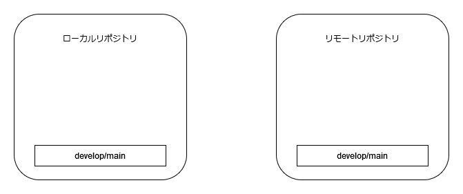
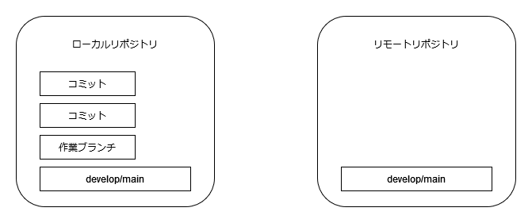
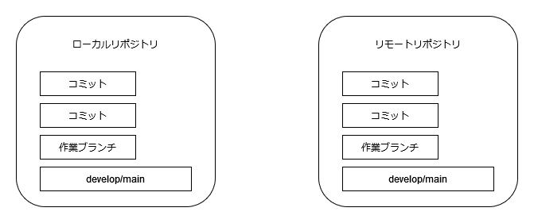

# ローカルリポジトリとリモートリポジトリ

* リモートリポジトリはサーバーにある
* ローカルリポジトリは各自のPCにある
  * リモートリポジトリを各自コピーして使っている

# cloneしたての状態

* developやmainがローカルにコピーされる

# ローカルのPCで作業中

* 作業ブランチを切ってそこにコミットを積む

# pushした状態

* リモートリポジトリへpushする
* ここでPR/MRやレビューが入る

# mergeされる

* レビューが完了してマージされる
* リモートからは作業ブランチは削除する

# 分散バージョン管理システム

* コピーを各自が持つことから **分散**
* そうではないシステムもあった
  * SVN