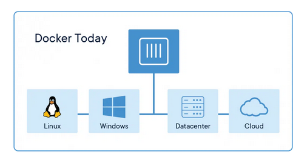
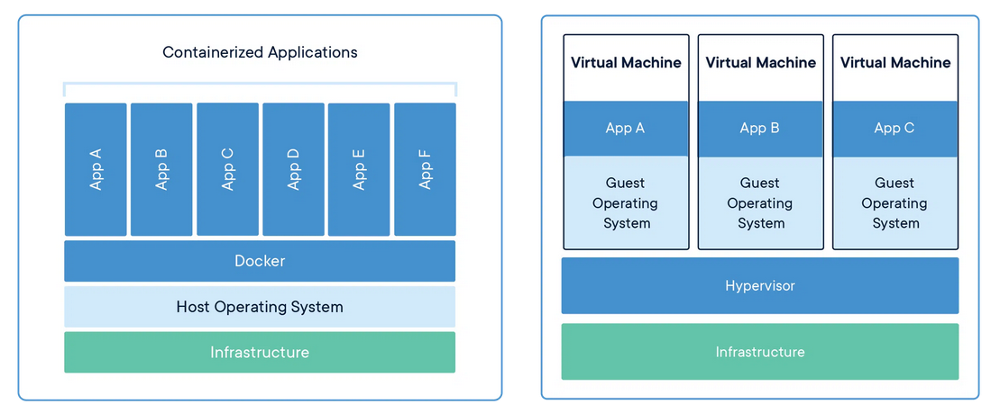

<style>
section.lead h1 {
  text-align: center;
  font-size: 90px;
}
</style>

# Docker
<!-- _class: lead -->

# Dockerとは

* Docker, Inc. の**コンテナ**技術
* **コンテナ**技術のデファクトスタンダード
* 有名なLT（ライトニングトーク）がある
  * https://www.youtube.com/watch?v=wW9CAH9nSLs

# コンテナとは

* コードとその"依存"をパッケージ化
* アプリケーションの実行に必要な全てを含む
  * コード、ランタイム、システムツール、システムライブラリ、コンフィグ
* ローカルの開発環境から本番環境まで様々な場面で使われる

# Dockerは様々な場所で使われる


https://www.docker.com/resources/what-container/

# VMとの比較

* Docker
  * Linuxのユーザランドのプロセスとしてコンテナを立ち上げる
  * ホストのカーネルは共有されている
* VM
  * 抽象化されたハードウエア上にOSを乗せる
  * 実行に必要な全てをVM上に構築

# VMとの比較


https://www.docker.com/resources/what-container/

# この授業におけるDocker

* 環境を一致させる重要性
  * あらゆるソフトウエアにはバージョンがある
  * バージョン差異によって不具合が出たり出なかったりする
  * それぞれの手元にある環境およびサーバー上の環境の一致が大事

# Dockerfile
* Dockerコンテナのイメージのビルド手順を定義するファイル
  * ベースイメージの指定
  * パッケージのインストール
  * ファイルのコピー
  * 環境変数の設定

# devcontainer
* Dockerコンテナ内でVS Codeの開発環境を起動
  * Dockerfile
  * devcontainer.json
* 全員の開発環境が一致する

# DockerとmacOS
* DockerはホストのLinuxを使っている
* macOS上ではそのままでは動かない
* macOS上にVMを立てて動かす

# Docker Desktop
* 一発でDockerのセットアップが終わる
* 色んなGUIツールが付属する

# Dockerのインストール
brewでインストールしたい
https://formulae.brew.sh/cask/docker
```bash
$ brew install --cask docker
```
