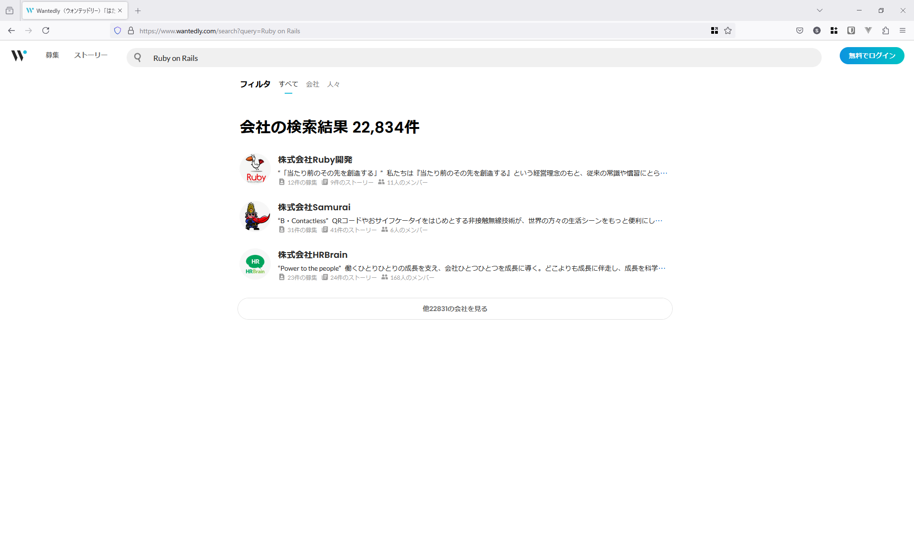
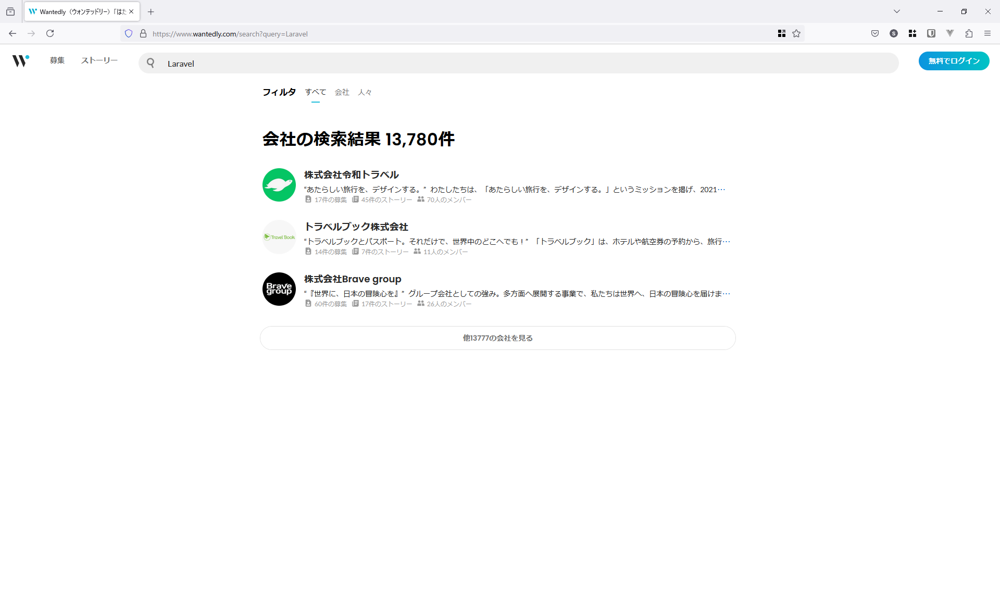
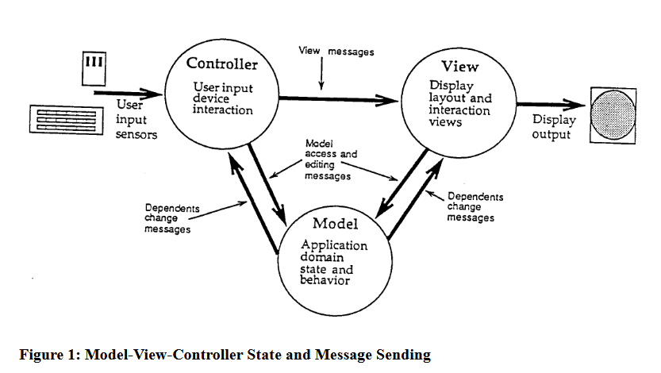

<style>
section.lead h1 {
  text-align: center;
  font-size: 90px;
}
</style>

# MVCとデータベース
<!-- _class: lead -->

# この講義の狙い
<!-- _class: lead -->

# 背景1: MVCの浸透
* MVCフレームワークと呼ばれるフレームワークと共に、MVCという概念は世の中に浸透していて、エンジニアは当たり前のようにこの言葉を使う。
* RailsやLaravelやDjangoは非常に人気で、求人票に要件として書いてあることも多く、それぞれ案件が多い。

# 背景1: MVCの浸透 Ruby on Rails



# 背景1: MVCの浸透 Laravel


# 背景2: MVCフレームワークとデータベースの関係の深さ
* MVCフレームワークは主にバックエンドに使用され、特にデータベースとの関連が深く、データベースを触る場合、MVCフレームワークについての理解が重要になる。
* 多くの企業で、データベースはMVCフレームワークを介して操作されている。

# 背景3: MVCとは結局なんなのか誰も教えてくれない場合が多い
* 根幹になる概念だが体系的に教えてくれることは少ない気がする
* ググると断片的に色々出てくる

# この講義の狙い
* MVCの起こりと歴史を学び、断片的な情報を整理する基礎を得る
* 現代におけるMVCの意味を学ぶ。


# MVCとは
<!-- _class: lead -->

# SmalltalkのMVC

* MVC Model-View-Controller
  * 1979年
  * Trygve Reenskaug
  * パロ・アルト研究所
* Smalltalk-76で初めて提案される。
  * その後、Smalltalk-80で広く採用される。


# オリジナルのMVCの考え方として以下の論文を見る
* A Description of the Model-View-Controller User Interface Paradigm in the Smalltalk-80 System
  * Glenn E. Krasner and Stephen T. Pope
  * ParcPlace Systems, Inc.
  * 1988年


# MVCの図


# オリジナルの表現を見ていく
* The Smalltalk-80 implementation of the Model-View-Controller metaphor consists of three abstract superclasses named Model, View, and Controller, plus numerous concrete subclasses.
  * Model-View-Controllerメタファー
  * three abstract superclasses
    * Model
    * View
    * Controller

# Modelクラス
* Models hold onto a collection of their dependent objects. The class Model has message protocol to add and remove dependents from this collection.
  * hold onto a collection
    * of their dependent objects.
  * has message protocol
    * to add and remove dependents

# Modelとは
* コレクションを保持する
  * コレクションは（おそらく）RDBでいうテーブルとレコード
* メッセージプロトコルを持つ
  * コレクション内の追加や削除についてそれらを別のオブジェクトに通知する手段を持つ

# note: ステートフルとステートレス
* 基本的にMVCは **ステートフル** なGUIアプリケーションを念頭に置いている。
  * 状態を持ち、Modelが状態をコントロールする。
* Webは **ステートレス** な通信を基礎としている。
* MVCをWebに持ち込むには限界がある。

# Viewクラス
* This includes model and controller interaction, subview and superview interaction, coordinate transformation, and display rectangle actions.
  * model and controller
  * subview and superview
  * coordinate transformation
  * display rectangle actions

# Viewとは
* 見た目に関するもの
* モデル、コントローラーと相互のインタラクションがある
* サブビューとスーパービューがある
  * 現代のコンポーネント指向のフロントエンドと似てるか

# note: バックエンドにおけるView
* フロントエンドとバックエンドにシステムが分かれている場合、MVCのViewはフロントエンドの機能に当たるはず。
* 例えばDjango REST FrameworkなどではAPIViewといったクラスがあり、APIの返り値をViewに見立てるような形になっている。
  * この事実も現代のWebのアーキテクチャにMVCを適用する際の限界だと思う。

# Controllerクラス
* It is a controller's job to handle the control or manipulation (editing) functions of a model and a particular view.
  * control function of a model and a view.

* The abstract superclass Controller contains three instance variables: model, view, and sensor,

# Controllerとは
* modelとviewに関する機能を担う
* model, view, sensorが格納されているらしい

# note: 現代におけるControllerとの差異
* 通常model相当のクラスを直接持つことはない
* バックエンドのAPIサーバーとして実装される場合viewも持たない
* sensorという概念はバックエンドにはない
* 現在Controllerと呼ばれているものを元々の意味のControllerと同一視することは不可能だと思う

# (現代における)MVCとは
<!-- _class: lead -->

# Java Springの例
<!-- _class: lead -->

# ORMのEntityとMVCのModelが共存する
* Java Spring で使われる ORM `Hibernate` の `@Entity`
* Java Spring MVCで使われる `model`

# Hibernate
```java
import jakarta.persistence.Entity;
import jakarta.persistence.Id;
import jakarta.persistence.GeneratedValue;
import jakarta.persistence.GenerationType;

@Entity
public class User {

    @Id
    @GeneratedValue(strategy = GenerationType.IDENTITY)
    private Long id;
    private String name;
    private String email;

    // デフォルトコンストラクタ（必須）
    public User() {
    }
```

# note: Hibernateとjakarta
* ORMのAPIであるJakartaと実装であるHibernateが存在している
* HibernateをインストールしJakartaのパッケージをインポートして書く
* Jakartaは以前はJPAという名前だった
  * `javax.persistance.Entity` というようなパッケージ名だった

# Hibernate

```java
    // ゲッターとセッター
    public Long getId() {
        return id;
    }

    public void setId(Long id) {
        this.id = id;
    }

    public String getName() {
        return name;
    }

    public void setName(String name) {
        this.name = name;
    }
```

# Hibernate

```java
    public String getEmail() {
        return email;
    }

    public void setEmail(String email) {
        this.email = email;
    }
}
```

# JavaのGetterとSetterを書く文化
* 値の取得のためにGetterを書き、更新のためにSetterを書く
* 変数そのものはprivateにしておく
* 外部的な振る舞いを変えずにメンバーを変更することはできるが……
  * 正直冗長過ぎる

# Spring MVC model
```java
import org.springframework.stereotype.Controller;
import org.springframework.ui.Model;
import org.springframework.web.bind.annotation.GetMapping;
import org.springframework.web.bind.annotation.RequestParam;

@Controller
public class UserController {

    @GetMapping("/user")
    public String getUser(@RequestParam(name="name", required=false, defaultValue="Guest") String name, Model model) {
        model.addAttribute("name", name);
        return "userView";
    }
}
```

# note: ControllerがViewとModelを持っている
* MVCが提唱された当初の形をなるべくWebに持ち込もうとしている
* modelがDBと関係ない概念として導入されている

# `src/main/resources/templates/userView.html`
```html
<!DOCTYPE html>
<html xmlns:th="http://www.thymeleaf.org">
<head>
    <title>User View</title>
</head>
<body>
    <h1>Hello, <span th:text="${name}">User</span>!</h1>
</body>
</html>
```

# Ruby on RailsのMVC
<!-- _class: lead -->

# modelの意味合いが変わった
* MVCにおけるmodelとORMにおけるmodelが密結合となった
* modelがアプリケーションのデータとビジネスロジックを担当する概念になった
* Ruby on Railsライクなフレームワークが流行った
* 現在Ruby on RailsライクなフレームワークのことをMVCフレームワークなどと呼んでいる


# コードにするとこう
```ruby
# app/models/user.rb
class User < ApplicationRecord
  # バリデーション
  validates :name, presence: true
  validates :email, presence: true, uniqueness: true

  # ビジネスロジック
  def full_name
    "#{first_name} #{last_name}"
  end
end
```

# Railsにおける処理の流れとMVC
1. **リクエストの受け取りと処理**
   - コントローラーがユーザーからのHTTPリクエストを受け取り、それに応じたアクションを実行します。
2. **モデルとの連携**
   - コントローラは必要に応じてモデルとやり取りを行い、データベースから情報を取得したり、データを保存したりします。モデルはデータの管理やビジネスロジックを担当します。

# Railsにおける処理の流れとMVC
3. **ビューの選択**
   - コントローラはリクエストの処理が完了した後、適切なビューを選択し、ユーザーにレスポンスを返します。ビューはユーザーに表示されるインターフェース部分を担当します。

# コントローラーの例
```ruby
class PostsController < ApplicationController
  # 一覧表示
  def index
    @posts = Post.all
  end
  # 詳細表示
  def show
    @post = Post.find(params[:id])
  end
  # 新規作成フォーム表示
  def new
    @post = Post.new
  end
```

# コントローラーの例
```ruby
  # 投稿の作成
  def create
    @post = Post.new(post_params)
    if @post.save
      redirect_to @post
    else
      render 'new'
    end
  end
  # 編集フォーム表示
  def edit
    @post = Post.find(params[:id])
  end
```

# コントローラーの例
```ruby
  # 投稿の更新
  def update
    @post = Post.find(params[:id])
    if @post.update(post_params)
      redirect_to @post
    else
      render 'edit'
    end
  end
  # 投稿の削除
  def destroy
    @post = Post.find(params[:id])
    @post.destroy
    redirect_to posts_path
  end
```

# コントローラーの例
```ruby
  private
  # Strong Parameters
  def post_params
    params.require(:post).permit(:title, :content)
  end
end
```

# ORMのモデルにビジネスロジックを書くことの是非
* ビジネスロジックはライブラリ等から隔離すべきという考え方が優勢
* ORMのモデルに直接ビジネスロジックを書く方法はあまり良い方法とされていないことが多い

# モデルの概念の拡張という方針
* 主にRailsで取られる方針
  * Railsでは後述するサービスレイヤーという方法は良くないとされている場合がある
  * ActiveModelというのを使う
  * https://railsguides.jp/active_model_basics.html

# サービスレイヤー
* 以下のような目的でサービスレイヤーを設けることが多い
  * コントローラーから直接ORMのモデルを呼び出さない
  * ORMのモデルにロジックを書かない

# コントローラーから直接ORMのモデルを呼び出さない
* サービスレイヤーを設ける場合MとCが分離される
* "責務"が違う
  * コントローラーはリクエストとレスポンスの処理
  * ORMのモデルはデータベースのテーブルとクラスのマッピング

# ORMのモデルにロジックを書かない
* 「Railsではモデルにロジックを書く」と説明されることがある。
  * Active Recordとは、MVCで言うところのM、つまりモデルの一部であり、データとビジネスロジックを表現するシステムの階層です。
    * https://railsguides.jp/active_record_basics.html 
  * これには強い反対意見がある
    * モデルにロジックを書く代わりにサービスレイヤーを設ける

# ここまでのまとめ
* MVCは1979年にSmalltalk-76で初めて提案され、その後Smalltalk-80で広く採用された。
* Javaのフレームワーク（特にJava EEやSpring Framework）がMVCパターンをWebアプリケーションに適用した。
* Rails（Ruby on Rails）は、MVCパターンを簡潔で使いやすい形で再定義し、Web開発における標準的なアーキテクチャとして普及させた。
* Railsの影響により、Web開発におけるMVCの理解や実装方法が広く受け入れられるようになった。

# MVCにおけるデータベース
* ORM経由でデータベースへアクセスする
* RailsではORMのモデルとMVCのモデルが同一視されている傾向がある
  * ORMのモデルにそのままロジックを持たせる派閥が存在する
* コントローラー、もしくはサービスレイヤーからORMのモデルを呼び出す場合が多い

# MVCはデータベースの設計の影響を大きく受ける
* テーブルに対してORMのModelが作られる
* 多くはModelを中心にして考える
* テーブルを跨ぐ場合の実装がしばしば論点になる
* 設計資料が画面定義とデータベースのER図だけという場合が多い

# Djangoを例に
<!-- _class: lead -->

# プロジェクトとアプリの作成
```bash
django-admin startproject myproject
cd myproject
python manage.py startapp myapp
```

# モデルの定義
```python
# myapp/models.py
from django.db import models

class User(models.Model):
    username = models.CharField(max_length=100)
    email = models.EmailField()

    def __str__(self):
        return self.username
```

# マイグレーションの作成と適用
```bash
python manage.py makemigrations
python manage.py migrate
```

# サービスの作成
```python
from .models import User

class UserService:
    @staticmethod
    def get_user_by_id(user_id):
        try:
            return User.objects.get(id=user_id)
        except User.DoesNotExist:
            return None
```

# コントローラーの作成
```python
myapp/views.py
from django.http import JsonResponse
from .services import UserService
def get_user(request, user_id):
    user = UserService.get_user_by_id(user_id)
    if user:
        data = {
            'id': user.id,
            'username': user.username,
            'email': user.email
        }
        return JsonResponse(data)
    else:
        return JsonResponse({'error': 'User not found'}, status=404)
```

# URLの設定
```python
# myapp/urls.py
from django.urls import path
from .views import get_user

urlpatterns = [
    path('user/<int:user_id>/', get_user, name='get_user'),
]
```

# URLの設定のインクルード
```python
# myproject/urls.py
from django.contrib import admin
from django.urls import path, include

urlpatterns = [
    path('admin/', admin.site.urls),
    path('api/', include('myapp.urls')),
]
```

# データの作成
```bash
python manage.py createsuperuser
python manage.py runserver
```
`http://127.0.0.1:8000/admin/`

# APIを叩く
```bash
curl http://127.0.0.1:8000/api/user/1/
```

# 用語の復習
* MVC
  * もともとは1979年にパロ・アルト研究所で提案されSmalltalk-80で広まったGUIアプリケーションのためのアーキテクチャ
  * Ruby on Railsによって再定義され、現在のWeb業界で使用される意味になった。
* Smalltalk-80
  * オブジェクト指向のプログラミング言語。1980年代から80とついている。

# 用語の復習
* Ruby on Rails
  * 現在使われる多くのWebアプリケーションフレームワークに影響を与えたフレームワーク。LaravelやDjangoもRuby on Railsに強く影響されている。
* ステートフル
  * 状態を持つということ。例えば状態Aのときに受け付けた操作Xと状態Bのときに受け付けた操作Xで振る舞いが変わる。
* ステートレス
  * 状態を持たないこと。Webはステートレスな通信を基礎としている。

# 用語の復習
* サブ-, スーパー-
  * 何かの特徴の一部分を切り出したようなものに対してサブ-という接頭辞をつけることがある。サブクラス、サブタイプなど。
  * 反対に何かが自身の特徴の一部分である場合にスーパー-という接頭辞をつけることがある。スーパークラス、スーパーセットなど。

# 用語の復習
* Java Spring
  * 非常に歴史のあるJavaのWebアプリケーションフレームワーク。
  * Java Spring MVCというMVCを実現するシステムもある。どちらかと言えばSmalltalkにおけるMVCの意味に近く。特にモデルはRuby on Railsでいうモデルとは大きく異なったものになっている。

# 用語の復習
* Jakarta, JPA
  * JPAはJava Persistance APIの略。Jakartaはその後継。JavaのORM向けのAPI
* Hibernate
  * JavaのORM
  * Jakarta, JPAが実装されている

# 用語の復習
* コントローラー
  * 現代においては、HTTPリクエストを受け取り対応したメソッドを呼び出すクラスのこと。ビューを返す場合とAPIとしてJSONを返す場合がある。
* サービスレイヤー
  * MVCにおいてはコントローラーとモデルの間にあるレイヤー。コントローラーから直接モデルを参照することや、モデルにロジックを書くことを防ぐ。

# 用語の復習
* モデル
  * 現代ではORMのモデルを指す。Ruby on RailsにおいてはORMのモデルに直接ロジックを書く場合があり、これには強い反対意見もある。
* ビュー
  * 現代ではコントローラーに返されるHTMLやそのテンプレートファイルを指す。
* ビジネスロジック、ドメインロジック
  * フレームワークと関係ないそのアプリケーション固有のロジック
