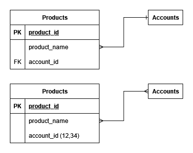
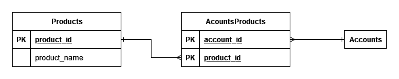

<style>
section.lead h1 {
  text-align: center;
  font-size: 90px;
}
</style>

# SQLアンチパターン
<!-- _class: lead -->

# 書評1
- <前略> 彼のユニークなスタイルとユーモアのセンスがよく表れている。それは、下手をしたら無味乾燥なものになりかねないトピックを取り上げるうえでとても重要なものだ。<後略>
  - by Arjen Lentz
  - Open Query (http://openquery.com) エグゼクティブ・ディレクター
  - 「実践ハイパフォーマンス MySQL 第2版」共著者

# 書評2
- <前略>本書で登場するアンチパターンには、「こんな失敗をしていたなんて信じられない（しかも繰り返し）！」という発見から、最善の解決策が、SQLを学んでいたときにには正しいとされていたものとは反することもあるというトリッキーなシナリオに至るまで実に様々である。SQLの初心者から専門家に至るあらゆるレベルの人にとって有益な書物だ。
  - Danny Thorpe
  - Microsoft社 プリンシパルエンジニア
  - 「Delphi Component Design」著者

# ジェイウォーク
<!-- _class: lead -->

# 前提
- あなたはバグ管理アプリケーションの新機能を開発している。
  - 製品の連絡窓口として、ユーザーを1人追加する機能。
- 後になって1つの製品に複数ユーザーを連絡先として登録できるようにして欲しいという要望が出た。

# アンチパターンの実装
- 列にアカウントIDを1件のみ格納するのではなく、カンマ区切りで複数のアカウントIDのリストを格納できるようにすればよいと考えた。
- その通りに実装した後、以下のような問題がおきた。
  - 「うちの開発部門では、プロジェクトに関連会社の社員も追加するようになった。だが、システムには1つのプロジェクトで5人までしか登録できないらしい。それ以上追加しようとするとエラーになるというクレームが来ている。一体どうなっているんだ？」

# 開発者の回答
- 「そうです。プロジェクトに登録できる人数には限りがあります。」
- 「登録できるのは、5人から10人くらいです。それは、ユーザーがアカウントを作った時期によって変わります。」

# 開発者の回答続き
- 「アカウントIDは、カンマ区切りのリストで格納している。しかしこのリストは定義された長さの文字列に収まる必要があります。つまりIDの長さが短ければ、リストに加えられる数が増えます。初期にIDを作った人は99以下のIDが割り振られているので、文字数が少なくなるのです。」

# ジェイウォークの由来
- 開発者はよく「多対多」の関連を表現する**交差テーブル**の作成を避けるために、カンマ区切りのリストを使います。私はこのアンチパターンを **ジェイウォーク（信号無視）** と名付けました。どちらもintersection(交差点/交差テーブル)を避けようとする行為だからです。

# 多対1の関係
```sql
CREATE TABLE Products (
  product_id   SERIAL PRIMARY KEY,
  product_name VARCHAR(1000),
  account_id   BIGINT UNSIGNED,
  -- . . .
  FOREIGN KEY (account_id) REFERENCES Accounts(account_id)
);

INSERT INTO Products (product_id, product_name, account_id)
VALUES (DEFAULT, 'Visual TurboBuilder', 12);
```

# 複数のaccount_idに対応
```sql
CREATE TABLE Products (
  product_id   SERIAL PRIMARY KEY,
  product_name VARCHAR(1000),
  account_id   VARCHAR(100), -- comma-separated list
  -- . . .
);

INSERT INTO Products (product_id, product_name, account_id)
VALUES (DEFAULT, 'Visual TurboBuilder', '12,34');
```

# note: これは第一正規形を満たしていない
- 第一正規形 (1NF) を満たすためには、テーブルの各列が原子値（単一の値）を持つ必要があります。

# note: ER図に起こす


# note: 解決策 中間(交差)テーブルを作る


# 特定のアカウントに関連する製品の検索
```sql
-- START:where
SELECT * FROM Products WHERE account_id REGEXP '[[:<:]]12[[:>:]]';
-- END:where
```

# 特定の製品に関連するアカウントの検索
```sql
-- START:join
SELECT * FROM Products AS p JOIN Accounts AS a
    ON p.account_id REGEXP '[[:<:]]' || a.account_id || '[[:>:]]'
WHERE p.product_id = 123;
-- END:join
```

# 中間テーブルがある場合
```sql
-- START:productbyaccount
SELECT p.*
FROM  Products AS p JOIN Contacts AS c ON (p.product_id = c.product_id)
WHERE c.account_id = 34;
-- END:productbyaccount
```

# 中間テーブルがある場合
```sql
-- START:accountbyproduct
SELECT a.*
FROM   Accounts AS a JOIN Contacts AS c ON (a.account_id = c.account_id)
WHERE c.product_id = 123;
-- END:accountbyproduct
```

# note: SQLのキーワード SELECT, FROM
- **SELECT**
  - SELECT 文は、データベースからデータを取得するために使用されます。指定された列や計算結果を返します。
- **FROM**
  - FROM 句は、データを取得するテーブルを指定します。複数のテーブルを結合する場合にも使用されます。

```sql
SELECT column1, column2 FROM table_name;
```

# note: SQLのキーワード WHERE
- **WHERE**
  - WHERE 句は、特定の条件を満たす行をフィルタリングするために使用されます。条件に一致する行のみが返されます。

```sql
SELECT column1, column2 FROM table_name WHERE condition;
```

# note: SQLのキーワード JOIN
- **JOIN**
  - JOIN 句は、複数のテーブルを結合するために使用されます。INNER JOIN、LEFT JOIN、RIGHT JOIN、FULL JOIN などの種類があります。
- **ON**
  - ON 句は、JOIN 句と共に使用され、結合条件を指定します。

```sql
SELECT columns FROM table1 JOIN table2 ON table1.column = table2.column;
```

# note: REGEXP
- REGEXP
  - REGEXP 演算子は、正規表現を使用してパターンマッチングを行います。指定されたパターンに一致する行を返します。

```sql
SELECT column FROM table WHERE column REGEXP 'pattern';
```

# note: SQLのキーワード AS
- AS
  - AS キーワードは、列やテーブルにエイリアス（別名）を付けるために使用されます。エイリアスを使用すると、クエリをより読みやすくすることができます。

```sql
SELECT column1 AS alias1, column2 AS alias2 FROM table_name AS alias_table;
```

# product_idに紐づくaccount_idのcountを取る
```sql
SELECT product_id, LENGTH(account_id) - LENGTH(REPLACE(account_id, ',', '')) + 1
    AS contacts_per_product
FROM Products;
```

# 中間テーブルがある場合
```sql
SELECT product_id, COUNT(*) AS accounts_per_product
FROM Contacts
GROUP BY product_id;
```

# note: LENGTH
```sql
SELECT LENGTH('Hello, World!') AS string_length;
```

# キーレスエントリ（外部キー嫌い）
<!-- _class: lead -->

# 研究所の管理者
- ビル、大変だ。研究所の設備を2人のマネージャーが同じ日に予約してしまっているんだ。なぜこんなことになってしまったんだろう。すぐに調べて修正してほしい。

- どちらのマネージャーも、その日にテスト設備がどうしても必要で、使えなければスケジュールが遅れてしまうとクレームをいってきているんだ。

# 前提
- そのアプリケーションは数年前に私がMySQLを用いて設計した設備管理アプリケーションでした。
- デフォルトのストレージエンジンは外部キー制約をサポートしていないMyISAMでした。
- 多くのリレーションシップがあったにもかかわらず、参照整合性を強制できませんでした。

# 問題発生
- 参照整合性を満たせないときに、レポートに不整合が出始め、小計が合わず、スケジュールにも重複が生じるようになったのです。

# 応急処置に失われる工数
- プロジェクトマネージャーからは、不整合を早めに検出するために定期的に実行するデータ品質管理スクリプトの作成を依頼されました。
- そこで私は、データベースを調べ、子テーブルで孤児になっている行が存在するなどの不正な状態を検出して、結果を電子メールで報告するスクリプトを何本か書きました。

# 破綻が見える
- スクリプトでは、すべてのテーブルの関連チェックが必要でした。データ容量が大きくなり、テーブルの数が増えるにつれ、品質管理用のクエリの数も増え、スクリプトの実行に時間がかかるようになり、電子メールの報告も長くなりました。

# 参照整合性の重要性
- 各テーブルの設計と同じくらい、テーブル間の**リレーションシップの設計**も重要。
- 特にデータベースに**参照整合性**を維持させることは多くのアプリケーションにおいて重要。
- 外部キー制約を宣言すると、親テーブルにその主キー(ユニークキー)が存在することを保証できる。

# アンチパターン: 外部キー制約を使用しない
- 外部キー制約を省略した方がシンプルで柔軟で高速といわれることがある。
- 代償として参照整合性を保証するためのコードを書く必要が出てくる。

# コード例
```sql
-- START:select
SELECT account_id FROM Accounts WHERE account_id = 1;
-- END:select
-- START:insert
INSERT INTO Bugs (reported_by) VALUES (1);
-- END:insert
```

# コード例
```sql
-- START:select
SELECT bug_id FROM Bugs WHERE reported_by = 1;
-- END:select
-- START:delete
DELETE FROM Accounts WHERE account_id = 1;
-- END:delete
```

# note: 完璧なコードなんてない
- 整合性を取るコードのミス
  - DBへの不正なデータの混入
  - 当然バグを誘発します
  - リスクの高い本番DBでの作業で対処するしかない

# note: トランザクションが必要
- `SELECT` した直後に変更があり整合性が壊れた状態で `INSERT`, `DELETE` してしまうケースが考えられる。
  - トランザクションが必要
  - トランザクションによるロックは多用すると性能劣化の原因にもなる

# ミスを調べなければならない
- ステータス一覧にないステータスを持つバグ
```sql
SELECT b.bug_id, b.status
FROM Bugs b LEFT OUTER JOIN BugStatus s
  ON (b.status = s.status)
WHERE s.status IS NULL;
```

# note: 似たようなケース全てで必要
- 整合性が壊れているかもしれないケース
  - 本来外部キー制約を貼るべきだったのに貼ってないところ全て
- 不正が見つかれば直さなきゃいけない
  - 簡単には直せないケースもある

# 外部キー制約の宣言
```sql
CREATE TABLE Bugs (
  -- . . .
  reported_by       BIGINT UNSIGNED NOT NULL,
  status            VARCHAR(20) NOT NULL DEFAULT 'NEW',
  FOREIGN KEY (reported_by) REFERENCES Accounts(account_id),
  FOREIGN KEY (status) REFERENCES BugStatus(status)
);
```

# note: この制約は無効化しない限り常に強制される
- 全てのDB操作に対して強制されます
  - その場限りの書き捨てスクリプト
  - アプリケーションコード

# カスケード更新
```sql
CREATE TABLE Bugs (
  -- . . .
  reported_by       BIGINT UNSIGNED NOT NULL,
  status            VARCHAR(20) NOT NULL DEFAULT 'NEW',
  FOREIGN KEY (reported_by) REFERENCES Accounts(account_id)
    ON UPDATE CASCADE
    ON DELETE RESTRICT,
  FOREIGN KEY (status) REFERENCES BugStatus(status)
    ON UPDATE CASCADE
    ON DELETE SET DEFAULT
);
```

# ON UPDATE句, ON DELETE句
- 参照先がUPDATEまたはDELETEされたときに特定の処理を行う

# CASCADE
- BugStatus テーブルの status が更新される。
- Bugs テーブルの status 列にその BugStatus.status を参照している行がある場合、その行の status 列も自動的に新しい BugStatus.status に更新される

# RESTRICT
- BugStatus の reported_by 列に Accounts.account_id が存在する場合、その Account 列が削除できなくなる。
